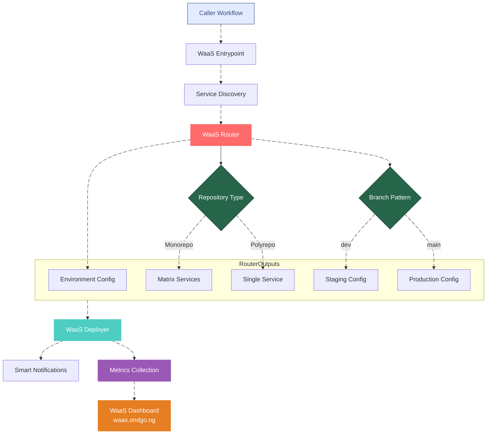
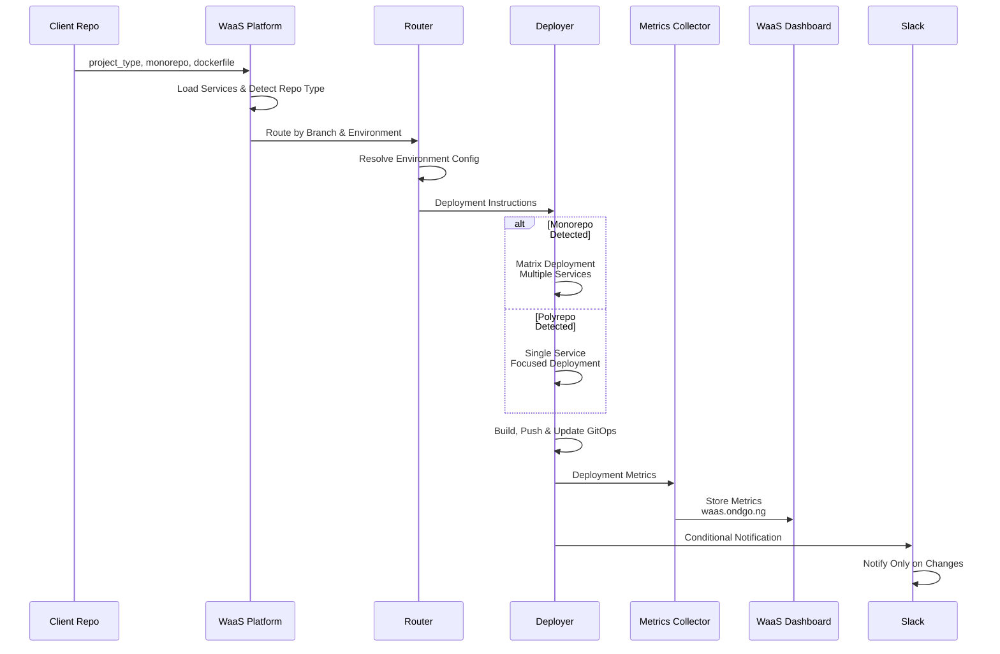

# 🚀 GitOps Workflow as a Service (WaaS)

A unified, enterprise-grade deployment platform that provides consistent GitOps workflows across multiple project types, repository structures, and environments through a simple, intelligent interface.

## 🌟 Overview

WaaS abstracts away deployment complexity with smart routing, conditional execution, intelligent notifications, and comprehensive metrics collection. It adapts to your repository structure (monorepo or polyrepo) and provides the optimal deployment strategy automatically.

## 🏗️ Architecture

### High Level Flow



### Detailed Flow



## 🚀 Quick Start

### Basic Usage - Monorepo (Default)

```yaml
# .github/workflows/gitops.yml
name: Deploy via WaaS

on:
  pull_request:
    branches: [ "dev", "main" ]
  push:
    branches: [ "dev", "main" ]

jobs:
  deploy:
    uses: SeamlessOps/waas/.github/workflows/waas.yml@v1
    with:
      project_type: dotnet  # or 'nx', 'python'
    permissions:
      id-token: write
      contents: read
    secrets: inherit
```

### View Deployment Metrics

All deployments automatically feed into the **WaaS Dashboard**:
```
📊 Live Dashboard: https://waas.ondgo.ng
```

## 📊 Metrics & Observability

### Automatic Metrics Collection

Every deployment automatically collects:
- ✅ **Deployment status** (success/failure/cancelled)
- ⏱️ **Deployment duration** in seconds  
- 🌍 **Environment** (staging/production)
- 🔧 **Service name** and project type
- 📝 **Commit information** (hash, author, message)
- 🕒 **Timestamp** of deployment

### Real-time Dashboard Features

Access your deployment metrics at **https://waas.ondgo.ng**:

- **📈 Live Statistics**: Success rates, average durations, deployment counts
- **🔍 Advanced Filtering**: By environment, service, status, time range
- **📱 Responsive Design**: Works on desktop and mobile
- **🔄 Auto-refresh**: Updates every 30 seconds
- **📊 Pagination**: Handle large deployment histories efficiently

### Example Dashboard View

```
Deployment Dashboard - Last 24 Hours
┌─────────────────┬────────────────┬─────────────┐
│ Total Deploys   │ Success Rate   │ Avg Duration│
│ 47              │ 94%            │ 45s         │
└─────────────────┴────────────────┴─────────────┘

Recent Deployments
┌────────────┬─────────────┬────────┬─────────┐
│ Service    │ Environment │ Status │ Duration│
├────────────┼─────────────┼────────┼─────────┤
│ api-gateway│ production  │ ✅     │ 38s     │
│ web-app    │ staging     │ ❌     │ 120s    │
│ auth-svc   │ production  │ ✅     │ 52s     │
└────────────┴─────────────┴────────┴─────────┘
```

## 🏷️ Inputs

| Parameter | Required | Default | Description |
|-----------|----------|---------|-------------|
| `project_type` | ✅ | - | `dotnet`, `nx`, `python`, `java`, `generic` |
| `monorepo` | ❌ | `true` | `true` for monorepos, `false` for single-service repos |
| `service` | ❌ | repo name | Service name (required if `monorepo: false`) |
| `dockerfile` | ❌ | `Dockerfile` | Dockerfile path for builds |
| `staging_env` | ❌ | `staging` | Staging environment name |
| `production_env` | ❌ | `production` | Production environment name |
| `staging_domain` | ❌ | `ondgo-dev` | Staging domain identifier |
| `production_domain` | ❌ | `ondgo-ng` | Production domain identifier |

## 🎯 How It Works

### 1. **Smart Service Discovery**
- **Monorepo**: Discovers multiple services from JSON configuration
- **Polyrepo**: Uses repository name as single service
- **Automatic validation** of service definitions and structure

### 2. **Intelligent Environment Routing**
```yaml
# Built-in branch → environment mapping:
"dev" branch   → Staging environment
"main" branch  → Production environment
```
- No configuration needed - follows organizational standards
- Centralized routing logic in reusable router component

### 3. **Adaptive Deployment Strategy**
- **Monorepo**: Matrix deployment for multiple services in parallel
- **Polyrepo**: Focused single-service deployment
- **Conditional execution**: Skips deployments when no changes detected

### 4. **Automatic Metrics Collection**
- **Real-time tracking**: Every deployment automatically recorded
- **GitOps storage**: Metrics stored in GitOps repository
- **Dashboard integration**: Live updates to waas.ondgo.ng
- **Zero configuration**: No setup required

### 5. **Smart Notifications**
- Notifies **only when deployments actually occur**
- Clear environment context and status
- No spam for skipped or unchanged deployments

## 📊 Metrics Storage & Access

### Data Flow
```
WaaS Deployment → GitOps Repository (metrics/) → WaaS Dashboard
```

### Access Your Data
- **Live Dashboard**: https://waas.ondgo.ng
- **Raw Metrics**: GitOps repository `metrics/data/deployments.json`
- **API Access**: REST endpoint for integration

## 📁 Repository Patterns

### Monorepo Structure
```json
// .github/workflows/services/<repository-name>.json
{
  "metadata": {
    "default_environments": ["staging", "production"]
  },
  "services": [
    {
      "name": "web-app",
      "directory": "apps/web",
      "nx_project": "web",
      "environments": ["staging", "production"]
    },
    {
      "name": "api-service",
      "directory": "apps/api", 
      "nx_project": "api",
      "environments": ["staging"]
    }
  ]
}
```

### Polyrepo Structure
```yaml
# Simple single-service deployment
monorepo: false
service: user-authentication  # Optional: defaults to repository name
```

## 🛠️ Development

### Adding New Project Types

Extend WaaS in 2 simple steps:

#### **1. Create Project Template**
```
workflow-templates/workload/templates/{project_type}/action.yml
```

**Example: `python/action.yml`**
```yaml
name: 'Python Deployment'
inputs:
  python_version:
    required: true
  requirements_file:
    required: false
    default: 'requirements.txt'
# Add your Python-specific build logic
```

#### **2. Use in Client Workflows**
```yaml
jobs:
  deploy:
    uses: SeamlessOps/waas/.github/workflows/waas.yml@v2
    with:
      project_type: python
      python_version: "3.11"
      # Automatically available to Python template
```

**Merge → Release → Done.** New project type available to all clients.

### Architecture Components

| Component | Purpose | Reusable |
|-----------|---------|----------|
| **WaaS Router** | Environment routing & configuration | ✅ `waas-router` |
| **Service Discovery** | Load services based on repo type | ✅ `load-services-matrix` |
| **Deployer** | Project-specific build & deployment | ✅ `waas/deployer` |
| **Metrics Collector** | Deployment tracking & analytics | ✅ `collect-metrics` |
| **Templates** | Technology-specific implementations | ✅ By project type |

## 🔍 Debugging

### View Intelligent Step Summaries
Each run provides detailed insights:
- Repository type detection (monorepo/polyrepo)
- Service discovery results
- Environment routing decisions
- Deployment outcomes
- Change detection results
- Metrics collection status

### Monitor Deployment Health
```
📊 WaaS Dashboard: https://waas.ondgo.ng
```

### Common Patterns

#### Monorepo Deployment
```
📦 Loaded 3 services for staging
🔄 Matrix deployment: api, web, worker → staging
✅ Deployed 3/3 services successfully
📊 Metrics recorded to dashboard
```

#### Polyrepo Deployment  
```
🎯 Single service: auth-api → production
🚀 Focused deployment completed
📊 Metrics recorded to dashboard
```

#### No Changes Detected
```
🎉 Smart detection: Image up-to-date
⏭️ Skipping deployment - no changes needed
💡 Saved: Build time & resources
```

## 🎯 Benefits

- **📊 Data-Driven Decisions**: Real-time deployment analytics
- **🔍 Operational Visibility**: Track patterns and identify trends  
- **🚀 Quality Metrics**: Monitor success rates and performance
- **🛠️ Troubleshooting**: Quickly identify problematic services
- **👥 Team Awareness**: Live dashboard accessible to entire organization
- **📈 Historical Analysis**: Maintain deployment history for reporting

---

**Ready to deploy?** Your metrics will automatically appear at **https://waas.ondgo.ng** 🎉